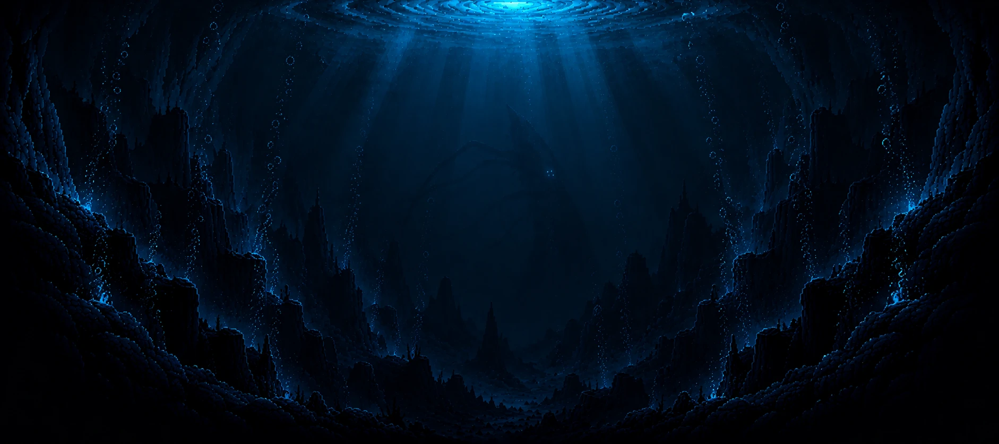

# Abyssal



**A fish-evolution roguelite for the browser, played like *The Binding of Isaac*.** You hatch
as a glassy larva in the nursery tank of an aquarium and fight your way down through three
tanks of one-screen rooms. Every mutation you take changes how you fight and shows on your
body. Beat the Giant Squid at the bottom of the deep tank and you are *released*.

## The game

### A run

A run is three **tanks**, each a map of 6–8 rooms dealt from the run's seed: a start, three or
more fights, a treasure room, a shop, a boss, and in half of all tanks a deal room off the boss.
Walk into a fight and its doors shut until every hostile in it is dead. A cleared room may drop
something. Beat the tank's boss and a drain opens in its floor: down it is the next tank, and
you are 1.8 times the size you were, in water authored at that scale.

| Tank | Boss | What lives there |
| --- | --- | --- |
| **The Nursery** | Mantis Shrimp, in its den of narrow clefts | mackerel in pairs, archerfish, pufferfish, sea nettles |
| **The Reef** | Great White, which breaches from the floor | ribbon eels in their holes, triggerfish, lionfish, moon jellies |
| **The Deep** | Giant Squid, which inks and comes back as ghosts | barracuda, gulper eels, vampire squid, anglerfish, siphonophores |

Every hostile has a moveset of its own and turns at half health: the mackerel flush red and
chain their dashes, the pufferfish bounces off the walls throwing fans, the moon jelly fades
out of the room and back. Each boss has a set piece, and a way to beat it with the room.

### Your body

- **Hearts**, in halves. A hit costs half a heart, a boss's a whole one; armour is a chance to
  shrug a hit off.
- **The strike** is on the arrows, and every larva hatches spitting jets of water. A bite that
  would kill swallows instead, and so does reaching a carcass: what goes down fills the
  **belly**, and a full belly passes a pickup.
- **Shells** buy from the shop, **keys** open locked doors and chests, and one **item** rides in
  your pocket, used on `Q`: a food pellet, an air stone, a nerite snail.

### Mutations

The pool is **76 mutations**, found on pedestals: free in the treasure room, for shells in the
shop, for heart containers in the deal room, beside a curse that costs nothing but a drawback.
Each has a drawing of the organ it grows, Isaac's word for what it does ("Tears up", "Triple
shot"), and, read before you take it, every number it would move on your body as before → after.

- **The stats are Isaac's**: damage, tears (strikes a second), range, shot speed and speed, shown
  down the left edge.
- **Primaries** change what the strike is: the spit, a fan of spines, a brood of fry that hunt
  and latch on (the *Mouthbrooder*), or the lunging bite.
- **Multishot** throws more of whatever the primary throws: a third eye for three shots, a
  second spout, four eyes for four.
- **Shot organs** change what the shots do, and stack: they burst, burn, chill, arc, pierce,
  home, split into fry, or call down a shaft of light.
- **Actives** fire on `Space` and recharge as rooms are cleared: ink, an electric shock, swelling.
- **Synergies come from the systems composing**, as Isaac's do: three fry that burn are a
  Mouthbrooder, a Parietal Eye and a Vent Gland, and nothing had to be written for it. Fifteen
  pairings do more than the sum and are named the first time they fire — *Shoal Hunt*, *Toxic
  Lure*, *Stonefish* — and kept in the codex.
- **Transformations.** Three mutations of one family remake the body: Predators become a
  **Shark**, Sprinters a **Squid**, Lurkers a **Moray**, the Luminous an **Angler**, Grazers a
  **Bloom**.

Everything you take shows on the larva: a water sac under the jaw, a needle bill, sulphur glands,
a halo, a third eye on the crown.

### Between runs

The codex keeps every species you have met, mutation you have taken and synergy you have found.
Reaching the reef unlocks the **Reef Wrasse** as a starting form, reaching the deep the **Squid
Paralarva**. The **Daily** is one seeded run shared by everyone on the same date, and any run can
be replayed or shared with `?seed=`.

### Controls

| | |
| --- | --- |
| Swim | `W` `A` `S` `D` |
| Strike | the arrows, four ways; each points the body, and shots lean with the swim |
| Active mutation | `Space` |
| Take | `E`, beside a pedestal or an item |
| Use the item | `Q` |
| Pause | `P` or `Esc`: your body, its stats and every mutation taken |
| Sound | `M` |

## Development

```bash
npm install
npm run dev      # the game, with HMR
npm run design   # the design board at /design.html
npm run build    # tsc --noEmit && vite build: the only gate
```

There is no test suite and no linter: `npm run build` type-checks in strict mode, and passing
it is what "it works" means. Almost every change is visual, so the real check is looking at it.
In dev builds the `Game` is `window.game`, to drive from the console ([`CLAUDE.md`](CLAUDE.md)
has the recipe).

**Launches** start a run past the title, in any tank and room: `/?tank=reef&room=boss&god=1` is
the Great White with nothing to lose. The keys are `tank` (nursery, reef, deep), `room` (start,
fight, treasure, shop, deal, boss), the flags `dropin`, `god`, `calm` (no hostiles) and `rich`,
and `start`, `traits` (mutation ids, comma-separated) and `seed`. The backquote key opens the dev
panel, with every launch and live actions on the run.

**The lab**, `/?lab=1` (`&tank=reef`, `deep`), is a room to try every mutation in: the treasure
room stocked with the whole pool a shelf at a time, free and restocking, with targets to shoot and
a damage-a-second meter. `[` `]` step the shelves, `T` holds the targets still, lets them fight or
clears them, `R` hatches a new body.

**The design board** (`/design.html`, dev only) lays out every drawing the game makes — rooms,
decoration, hostiles and bosses, pedestals and every mutation's drawing, body plans, every
mutation on the hatchling — each over the real water at its depth. It imports the shipping
drawing code, so it cannot drift from the game, and its URL is a link to one cell.

### Releases

`main` is always playable; work happens on short-lived branches off it, and a release is a
version tag on `main` with its notes in [`CHANGELOG.md`](CHANGELOG.md). `npm run release --
minor` does the whole of it. The process is in [`docs/releasing.md`](docs/releasing.md).

### How it is drawn

- **Pixel art, side-on, on one grid.** The frame renders at a fraction of the window and is
  scaled up with hard pixels; everything that draws sits on that grid.
- **The larva is painted from its genome**, per pixel, once per change to its body, and skinned:
  swimming moves mesh vertices, never geometry. A mutation has to show, so the paint reads the
  genome; nothing on a creature is stroked, and the outline is read off the silhouette.
- **Enemies are drawn from sprites.** They never mutate, so each species is one authored picture,
  imported from a generated sheet (`npm run sprite`, [`docs/sprites.md`](docs/sprites.md)).
- **The water is one GLSL pass**, shaded from world coordinates, and the room is made by its
  lights: dark navy water and dark stone, colour living on the rock, light pooled round what glows.

### Code map

The folders are layers, and imports only point down them
([`docs/architecture.md`](docs/architecture.md)).

| Folder | Responsibility |
| --- | --- |
| `src/main.ts`, `src/Game.ts` | Boot; the loop, the reset, and routing what the simulation did to the systems it concerns. |
| `src/core/` | Seeded RNG, maths, noise. No game knowledge. |
| `src/content/` | The tables: genome, species, tanks and rooms, traits, items, transformations, the body form. |
| `src/sim/` | The simulation: `World`, combat, hostile roles and movesets, bosses, spawning, and every organ's mechanic in `sim/organs/`. |
| `src/run/` | One run and the systems that move it: the tank map, evolution, the belly, the pockets, the ending, the codex. |
| `src/input/` | The keyboard, the player's swim and strike, and the stats. |
| `src/render/` | Camera, rooms, the water shader, shots, pedestals and item art; `render/creature/` paints and skins the fish. |
| `src/ui/` | The DOM HUD and screens. |
| `src/dev/`, `src/design/` | Launches, the dev panel, the lab, and the design board. Dev only. |

### Further reading

[`docs/`](docs/README.md) has the implementation notes — architecture, simulation, progression,
rendering, performance, the roadmap, and a log of what has been tried and undone; read
[`docs/decisions.md`](docs/decisions.md) before rebuilding anything that looks missing.
[`CONTEXT.md`](CONTEXT.md) is the glossary, and [`CLAUDE.md`](CLAUDE.md) the short version, for
agents.

| Piece | Choice |
| --- | --- |
| Renderer | PixiJS 8, pinned to WebGL, with a hand-written GLSL water shader |
| Build | Vite, TypeScript (strict) |
| UI | DOM and CSS over the canvas, in Pixelify Sans, bundled |
| Dependencies | Pixi and the font; the swimming, the ecosystem and the fights are all in `src/sim/` |
